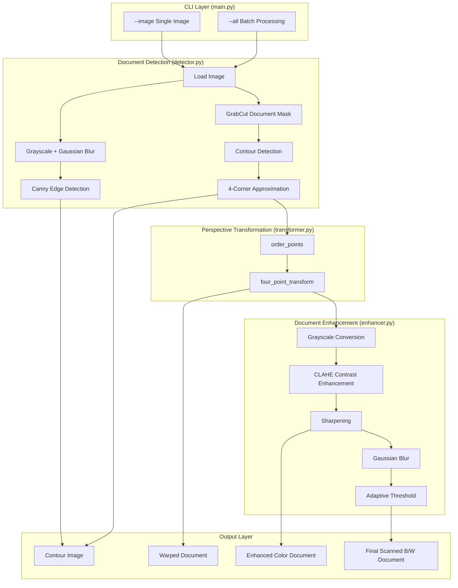

# System Architecture

```mermaid
flowchart TB

    subgraph CLI["CLI Layer (main.py)"]
        A["--image Single Image"]
        B["--all Batch Processing"]
    end

    subgraph Detect["Document Detection (detector.py)"]
        C["Load Image"]
        D["Grayscale + Gaussian Blur"]
        E["Canny Edge Detection"]
        F["GrabCut Document Mask"]
        G["Contour Detection"]
        H["4-Corner Approximation"]
    end

    subgraph Transform["Perspective Transformation (transformer.py)"]
        I["order_points"]
        J["four_point_transform"]
    end

    subgraph Enhance["Document Enhancement (enhancer.py)"]
        K["Grayscale Conversion"]
        L["CLAHE Contrast Enhancement"]
        M["Sharpening"]
        N["Gaussian Blur"]
        O["Adaptive Threshold"]
    end

    subgraph Output["Output Layer"]
        P["Contour Image"]
        Q["Warped Document"]
        R["Enhanced Color Document"]
        S["Final Scanned B/W Document"]
    end

    A --> C
    B --> C

    C --> D
    D --> E
    C --> F
    F --> G
    G --> H

    E --> P
    H --> I
    I --> J

    J --> Q
    J --> K
    K --> L
    L --> M
    M --> N
    N --> O

    H --> P
    M --> R
    O --> S
```
