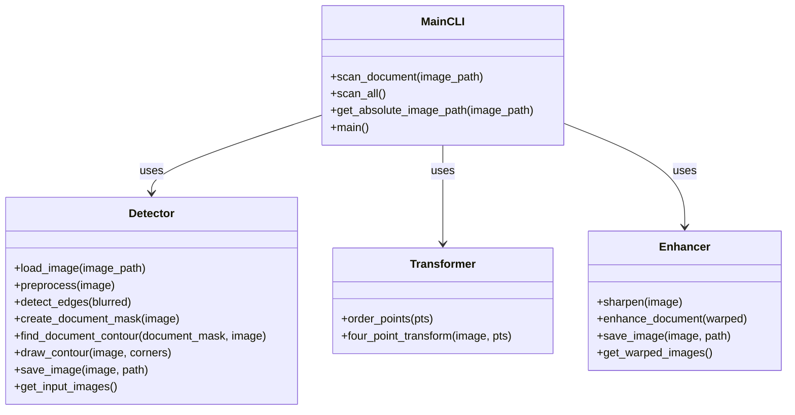

# Module / Component Diagram

```mermaid
classDiagram

    class Detector {
        +load_image(image_path)
        +preprocess(image)
        +detect_edges(blurred)
        +create_document_mask(image)
        +find_document_contour(document_mask, image)
        +draw_contour(image, corners)
        +save_image(image, path)
        +get_input_images()
    }

    class Transformer {
        +order_points(pts)
        +four_point_transform(image, pts)
    }

    class Enhancer {
        +sharpen(image)
        +enhance_document(warped)
        +save_image(image, path)
        +get_warped_images()
    }

    class MainCLI {
        +scan_document(image_path)
        +scan_all()
        +get_absolute_image_path(image_path)
        +main()
    }

    MainCLI --> Detector : uses
    MainCLI --> Transformer : uses
    MainCLI --> Enhancer : uses
```
