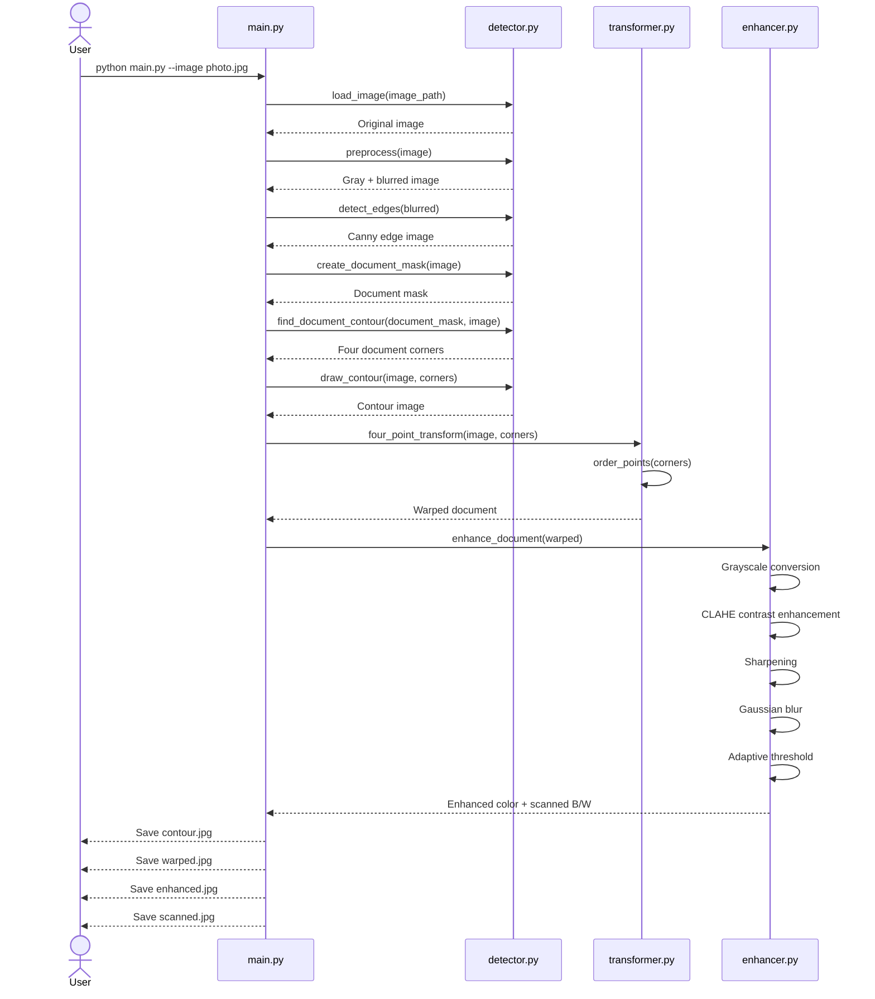

# Sequence Diagram — Scanning One Image

```mermaid
sequenceDiagram
    actor User
    participant CLI as main.py
    participant Det as detector.py
    participant Tra as transformer.py
    participant Enh as enhancer.py

    User->>CLI: python main.py --image photo.jpg

    CLI->>Det: load_image(image_path)
    Det-->>CLI: Original image

    CLI->>Det: preprocess(image)
    Det-->>CLI: Gray + blurred image

    CLI->>Det: detect_edges(blurred)
    Det-->>CLI: Canny edge image

    CLI->>Det: create_document_mask(image)
    Det-->>CLI: Document mask

    CLI->>Det: find_document_contour(document_mask, image)
    Det-->>CLI: Four document corners

    CLI->>Det: draw_contour(image, corners)
    Det-->>CLI: Contour image

    CLI->>Tra: four_point_transform(image, corners)
    Tra->>Tra: order_points(corners)
    Tra-->>CLI: Warped document

    CLI->>Enh: enhance_document(warped)
    Enh->>Enh: Grayscale conversion
    Enh->>Enh: CLAHE contrast enhancement
    Enh->>Enh: Sharpening
    Enh->>Enh: Gaussian blur
    Enh->>Enh: Adaptive threshold

    Enh-->>CLI: Enhanced color + scanned B/W

    CLI-->>User: Save contour.jpg
    CLI-->>User: Save warped.jpg
    CLI-->>User: Save enhanced.jpg
    CLI-->>User: Save scanned.jpg
```
