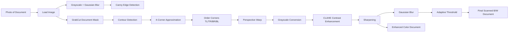

# Processing Workflow

```mermaid
flowchart LR
    A["Photo of Document"]
    --> B["Load Image"]

    B --> C["Grayscale + Gaussian Blur"]

    C --> D["Canny Edge Detection"]

    B --> E["GrabCut Document Mask"]

    E --> F["Contour Detection"]

    F --> G["4-Corner Approximation"]

    G --> H["Order Corners TL/TR/BR/BL"]

    H --> I["Perspective Warp"]

    I --> J["Grayscale Conversion"]

    J --> K["CLAHE Contrast Enhancement"]

    K --> L["Sharpening"]

    L --> M["Gaussian Blur"]

    M --> N["Adaptive Threshold"]

    N --> O["Final Scanned B/W Document"]

    L --> P["Enhanced Color Document"]
```
